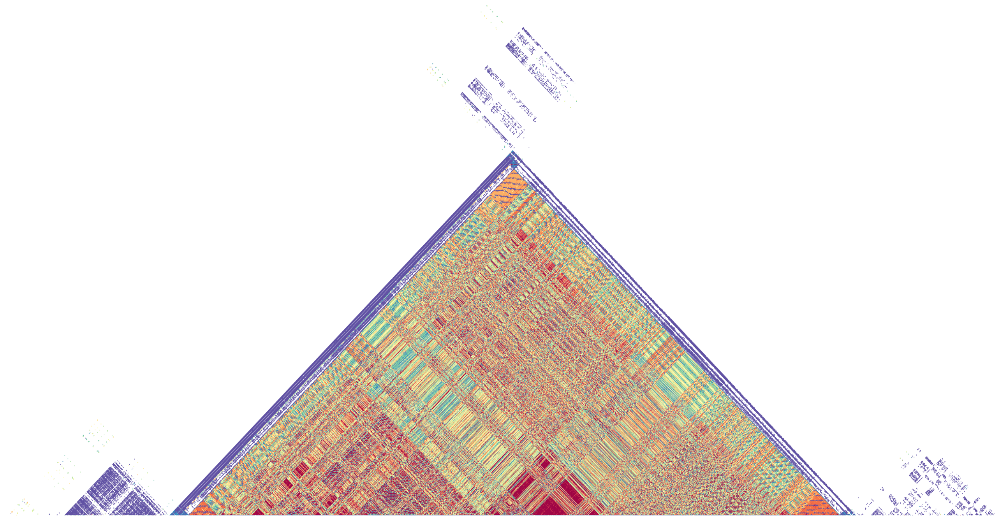

# StainedGlass

[](https://github.com/mrvollger/StainedGlass/actions)
[](https://github.com/mrvollger/StainedGlass/actions)
[](https://github.com/mrvollger/StainedGlass/actions)

This is a repository for making colorful identity heatmaps of genomic sequence.


## Installation

To install you can follow the directions on the [usage page](https://snakemake.github.io/snakemake-workflow-catalog?usage=mrvollger/StainedGlass) or use the information below.

You will need a current version of `snakemake` to run this workflow. To get `snakemake` please follow the install [instructions](https://snakemake.readthedocs.io/en/stable/getting_started/installation.html) on their website, but in brief once `conda` and `mamba` are installed you can install `snakemake` with:

```
mamba create -n snakemake -c conda-forge -c bioconda snakemake
```

Afterwards you can activate the `conda` environment and download the repository. And all additional dependencies will be handled by `snakemake`.

```
conda activate snakemake
git clone https://github.com/mrvollger/StainedGlass.git
```

## Running

Choose a sample identifier for your run e.g. `chr8` and a fasta file on which you want to show the colorful alignments and the modify the config file `config/config.yaml` accordingly.

Once this is done and you have activated your `conda` env with `snakemake` you can run the pipeline like so:

```
snakemake --use-conda --cores 24
```

Or do a dry run of the pipeline:

```
snakemake --use-conda --cores 24 -n
```

All parameters are described in `config/README.md` and you can modify any of them
by modifying `config/config.yaml`. You can also change the configuration via the command line. For example, to change the `sample` identifier and `fasta` options do:

```
snakemake --use-conda --cores 24 --config sample=test2 fasta=/some/fasta/path.fa
```

Please try the test case with the default configuration file before submitting issues.
If you are familiar with `snakemake` and want to trouble shoot yourself you can find the `Snakefile` in the directory `workflow`.

### Output

The file `results/{sample}.{\d+}.{\d+}.bed` will contain all the alignments identified by the pipeline, and is the main input for figure generation. Under the same prefix there will also be a bam file that contains the unprocessed alignments. Note the bam will contain additional alignments not present in the bed file because redundant alignments with lower scores are removed before the figure generation.

### Static dot-plots for moderate sized regions

To make pdfs and pngs for a particular set of regions just add `make_figures` to your command. This is generally appropriate for comparing up to ~5 regions totaling at most ~40 Mbp.

```
snakemake --use-conda --cores 24 make_figures
```

This will make an output directory under `results/{sample}.{\d+}.{\d+}_figures` with a variety of dot plots in `pdf` and `png` format.

If you see `tri.TRUE` in the output pdf/png it means that the dot plot is rotated and cropped into a triangle. If you see `onecolorscale.FALSE` it means that between different facets in the same plot different color scales are being used.

### Visualization of a large region or a whole genome

Making an interactive whole genome visualization requires the use of the program [HiGlass](https://higlass.io/) and a web browser. However, this pipeline will make the necessary input files with the following command:

```
snakemake --use-conda --cores 24 cooler
```

To view locally, use `higlass-manage`:

```
pip install higlass-manage
higlass-manage view results/small.5000.10000.strand.mcool
```

See the [T2T CHM13 v1.0 StainedGlass](https://resgen.io/paper-data/T2T/views/MtjcVgrlQmymnHIvdck5-g) for an example.

### High resolution interactive visualization

To create a high-resolution interactive visualization where the
coloring is proportionally to the number of reads mapped to each bin, use the following command:

```
snakemake --use-conda --cores 24 cooler_density --config window=32 cooler_window=100
```

## TODO

- Allow users to adjust the color pallet used in R
- Test short read aligners with smaller window sizes
- Make a more intelligent fragmentation method that won't be affected by offsets in repeat motifs
- Consider alternative ways to score cells with multiple non-overlapping alignments


## Cite
Vollger, Mitchell R., Peter Kerpedjiev, Adam M. Phillippy, and Evan E. Eichler. 2021. “StainedGlass: Interactive Visualization of Massive Tandem Repeat Structures with Identity Heatmaps.” BioRxiv. https://doi.org/10.1101/2021.08.19.457003. 
